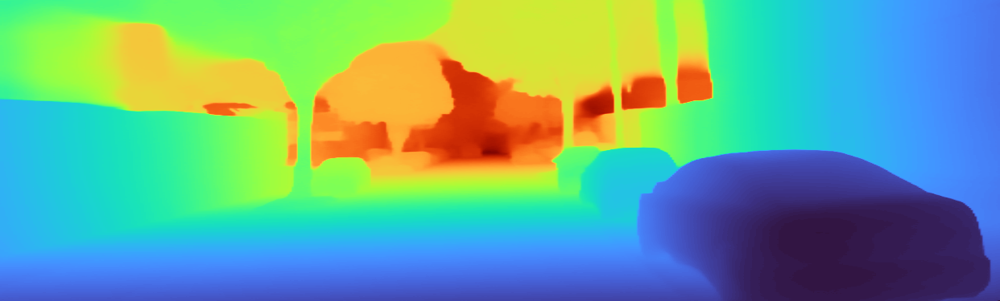

# tt-Depth-Anything-3

Tenstorrent Blackhole (p150a) port of the **Depth Anything V3 — Metric branch**
(`DA3Metric-Large`, 0.35 B params). Optimised for single-chip inference, with
a benchmark + KITTI Eigen accuracy harness validated against the canonical
ByteDance model bit-for-bit.

| Metric | CPU baseline (fp32) | Best chip pipeline (bf16) |
|--------|---------------------|----------------------------|
| Throughput | 0.66 fps | **5.23 fps** (median, 7.9× baseline) |
| KITTI Eigen AbsRel | 0.0906 | 0.0930 |
| KITTI Eigen RMSE (m) | 3.156 | 3.127 |
| KITTI Eigen δ<1.25 | 95.91% | 95.88% |
| Pearson PCC vs canonical DA3-Metric | 1.000000 | 0.999641 |

## Sample outputs

Three KITTI Eigen test images run end-to-end through the chip pipeline. Depth
shown with a `turbo` colormap on the log-clipped 1–50 m range — bright = near,
dark = far.

| Source | Predicted depth |
|--------|------------------|
|  |  |
|  |  |
|  |  |

## Layout

```
tt_depth_anything_3/
├── TODO.md             # outstanding work + anti-patterns log
├── results.tsv         # iteration history (kept/discard, fps, accuracy)
└── models/experimental/depth_anything_v3/
    ├── conftest.py             # pins TT_METAL_RUNTIME_ROOT for kernel paths
    ├── reference/
    │   └── dinov2_l_dpt.py     # CPU fp32 DA3-Metric reference (DinoV2-L + DPT)
    ├── tt/
    │   └── ttnn_da3_metric.py  # 24-block backbone on chip + bf16 channels-last CPU head
    ├── eval/
    │   ├── kitti_eigen.py      # 697-image Eigen test split loader
    │   ├── metrics.py          # KITTI 7 metrics + Pearson PCC
    │   ├── runner.py           # shared image preprocessing + chip/CPU adapters
    │   └── canonical.py        # canonical DA3-Metric loader (no sky post-proc)
    └── tests/
        ├── test_da3_perf.py        # fps/accuracy regression benchmark
        └── test_da3_kitti_eval.py  # KITTI vs canonical + GT comparison
```

## Setup

This repo only contains the model + harness code. To run, you also need:

1. **tt-metal + ttnn**, exposing the Blackhole runtime. The provided `conftest.py`
   pins `TT_METAL_RUNTIME_ROOT` to a sibling `tt-metal/` checkout — adjust
   `_MEDGEMMA_TREE` to point at your build of tt-metal.

2. **Canonical DA3 source** (`https://github.com/ByteDance-Seed/Depth-Anything-3.git`)
   — only needed for `eval/canonical.py`. Update `_CANONICAL_REPO_SRC` in
   that file to your clone path.

3. **Model weights** from HuggingFace, downloaded once into your HF cache:
   - `depth-anything/DA3Metric-Large` (standalone canonical, ~700 MB)
   - `depth-anything/DA3NESTED-GIANT-LARGE-1.1` (nested checkpoint we slice
     for our reference, ~6.3 GB)

4. **KITTI Eigen evaluation set** for accuracy. Reuse the original task's
   download (`exander/kitti-depth-gt` on HF datasets):

   ```bash
   python -c "from huggingface_hub import snapshot_download; \
     snapshot_download('exander/kitti-depth-gt', repo_type='dataset', \
       local_dir='/home/ttuser/experiments/da3/eval_data', \
       allow_patterns=['kitti_eigen_split_test.tar', 'gt_depths.npy'])"
   tar -xf /home/ttuser/experiments/da3/eval_data/kitti_eigen_split_test.tar \
     -C /home/ttuser/experiments/da3/eval_data/kitti_test
   curl -o /home/ttuser/experiments/da3/eval_data/splits/eigen_test_files.txt \
     https://raw.githubusercontent.com/nianticlabs/monodepth2/master/splits/eigen/test_files.txt
   ```

5. **Python deps** beyond a working ttnn install:

   ```bash
   pip install "numpy<2" opencv-python omegaconf imageio moviepy==1.0.3 \
     pillow_heif plyfile addict einops safetensors huggingface_hub
   ```

## Running

The benchmark + accuracy harnesses are pytest tests. Both must run from the
tt-metal source tree because ttnn's JIT kernel resolver looks at `cwd` first
(see `conftest.py` for the workaround).

```bash
# performance regression (single-frame fps + bf16 vs fp32 PCC)
cd /path/to/tt-metal && \
  PYTHONPATH=/path/to/tt_depth_anything_3:$(pwd) \
  pytest -s -q /path/to/tt_depth_anything_3/models/experimental/depth_anything_v3/tests/test_da3_perf.py

# KITTI Eigen accuracy (canonical vs ours-ref vs chip vs GT)
DA3_EVAL_LIMIT=20 \
  PYTHONPATH=/path/to/tt_depth_anything_3:$(pwd) \
  pytest -s -q /path/to/tt_depth_anything_3/models/experimental/depth_anything_v3/tests/test_da3_kitti_eval.py
```

`DA3_EVAL_LIMIT=697` runs the full Eigen split (~6 minutes).

## License

Code in this repo: Apache 2.0 (see commit `LICENSE`-bearing files).

The DA3 weights and canonical model code are released by ByteDance under
**CC BY-NC 4.0** — non-commercial use only.
